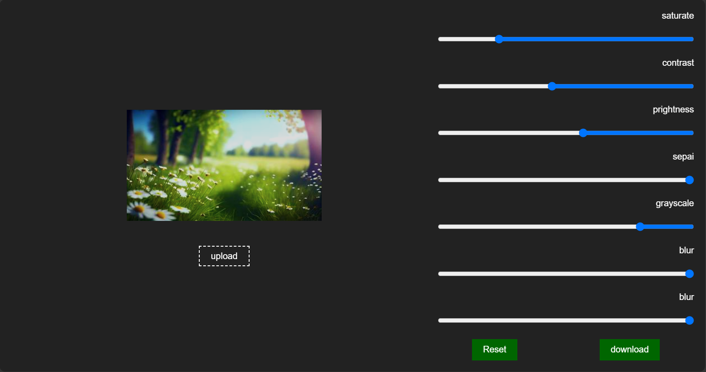

# Edit-Picture
Edit Your Picture With Easy Way With HTML,CSS,JAVASCRIPT

Edit Your Picture With Easy Way By Adding (saturate,contrast,brightness,sepai,grayscale,blur) and Download You Picture In The End.

